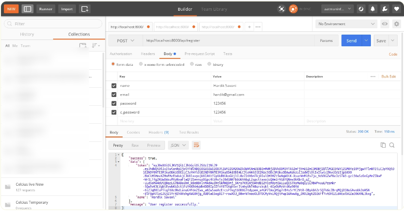
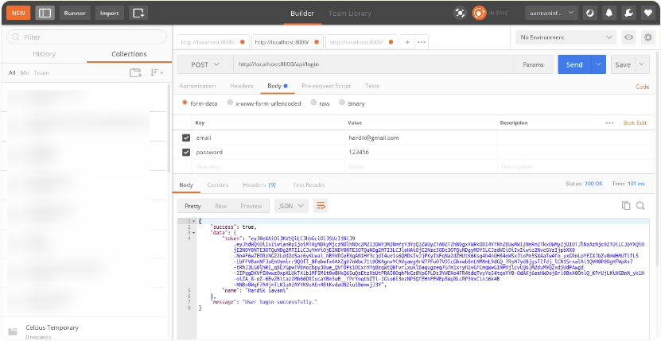
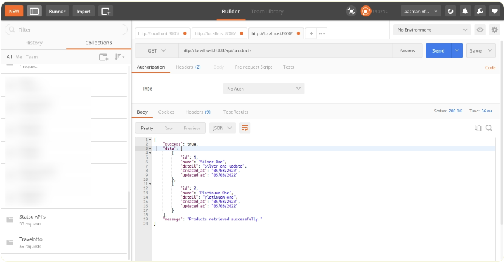
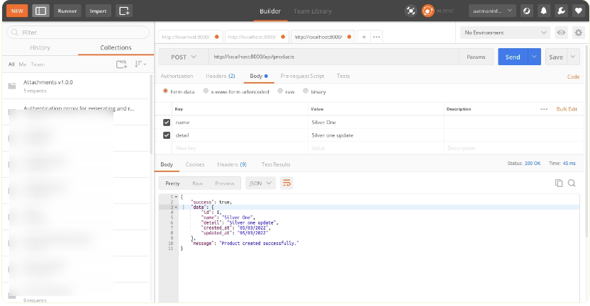
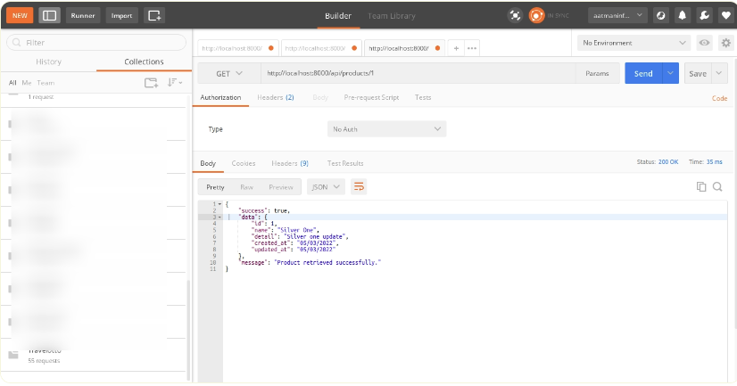
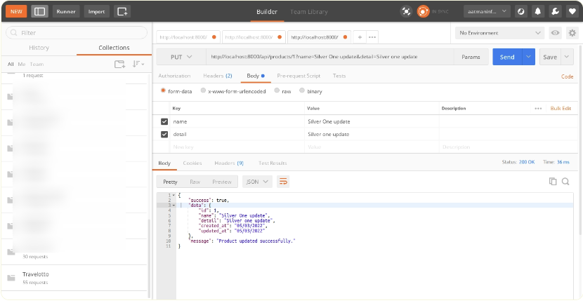
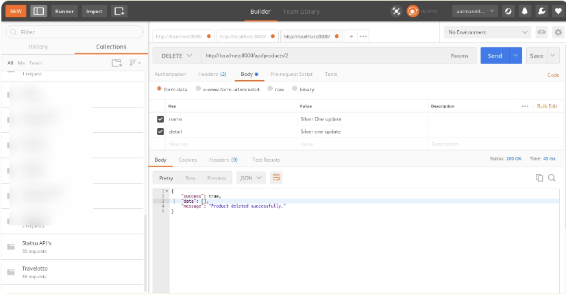

# laravel9_rest_api_with_passport_authentication
## 1: Install Laravel 9
```Dockerfile
composer create-project laravel/laravel laravel9_rest_api_with_passport_authentication
```
## 2:  Install Passport
```Dockerfile
composer require laravel/passport
```
- Tạo databasse
```Dockerfile
php artisan migrate
```
- cài đặt passport:
```Dockerfile
php artisan passport:install
```
## 3: Passport Configuration
- Vào app/Models/User.php
```Dockerfile
<?php
  
namespace App\Models;
  
use Illuminate\Contracts\Auth\MustVerifyEmail;
use Illuminate\Database\Eloquent\Factories\HasFactory;
use Illuminate\Foundation\Auth\User as Authenticatable;
use Illuminate\Notifications\Notifiable;
use Laravel\Passport\HasApiTokens;
  
class User extends Authenticatable
{
    use HasApiTokens, HasFactory, Notifiable;
  
    /**
     * The attributes that are mass assignable.
     *
     * @var array

     */
    protected $fillable = [
        'name',
        'email',
        'password',
    ];
  
    /**
     * The attributes that should be hidden for serialization.
     *
     * @var array

     */
    protected $hidden = [
        'password',
        'remember_token',
    ];
 
    /**
     * The attributes that should be cast.
     *
     * @var array

     */
    protected $casts = [
        'email_verified_at' => 'datetime',
    ];
}
```
- config/auth.php
```Dockerfile
<?php
return [
    .....
    'guards' => [
        'web' => [
            'driver' => 'session',
            'provider' => 'users',
        ],
        'api' => [
            'driver' => 'passport',
            'provider' => 'users',
        ],
    ],
    .....
]
```
## 4: Add Product Table and Model
```Dockerfile
php artisan make:migration create_products_table
```
-   database/migrations
```Dockerfile
<?php
  
use Illuminate\Database\Migrations\Migration;
use Illuminate\Database\Schema\Blueprint;
use Illuminate\Support\Facades\Schema;
  
return new class extends Migration
{
    /**
     * Run the migrations.
     *
     * @return void
     */
    public function up()
    {
        Schema::create('products', function (Blueprint $table) {
            $table->id();
            $table->string('name');
            $table->text('detail');
            $table->timestamps();
        });
    }
  
    /**
     * Reverse the migrations.
     *
     * @return void
     */
    public function down()
    {
        Schema::dropIfExists('products');
    }
};
```
- Chạy 
```Dockerfile
php artisan migrate
```
- Vào app/Models/Product.php
```Dockerfile
<?php
  
namespace App\Models;
  
use Illuminate\Database\Eloquent\Factories\HasFactory;
use Illuminate\Database\Eloquent\Model;
  
class Product extends Model
{
    use HasFactory;
  
    /**
     * The attributes that are mass assignable.
     *
     * @var array
     */
    protected $fillable = [
        'name', 'detail'
    ];
}
```
## 5: Create API Routes
- routes/api.php
```Dockerfile
<?php
  
use Illuminate\Http\Request;
use Illuminate\Support\Facades\Route;
  
use App\Http\Controllers\API\RegisterController;
use App\Http\Controllers\API\ProductController;
  
/*
|--------------------------------------------------------------------------
| API Routes
|--------------------------------------------------------------------------
|
| Here is where you can register API routes for your application. These
| routes are loaded by the RouteServiceProvider within a group which
| is assigned the "api" middleware group. Enjoy building your API!
|
*/
  
Route::post('register', [RegisterController::class, 'register']);
Route::post('login', [RegisterController::class, 'login']);
     
Route::middleware('auth:api')->group( function () {
    Route::resource('products', ProductController::class);
});

```
## 6: Create Controller Files
- app/Http/Controllers/API/BaseController.php
```Dockerfile
<?php


namespace App\Http\Controllers\API;


use Illuminate\Http\Request;
use App\Http\Controllers\Controller as Controller;


class BaseController extends Controller
{
    /**
     * success response method.
     *
     * @return \Illuminate\Http\Response
     */
    public function sendResponse($result, $message)
    {
    	$response = [
            'success' => true,
            'data'    => $result,
            'message' => $message,
        ];


        return response()->json($response, 200);
    }


    /**
     * return error response.
     *
     * @return \Illuminate\Http\Response
     */
    public function sendError($error, $errorMessages = [], $code = 404)
    {
    	$response = [
            'success' => false,
            'message' => $error,
        ];


        if(!empty($errorMessages)){
            $response['data'] = $errorMessages;
        }


        return response()->json($response, $code);
    }
}
```
- app/Http/Controllers/API/RegisterController.php
```Dockerfile
<?php
   
namespace App\Http\Controllers\API;
   
use Illuminate\Http\Request;
use App\Http\Controllers\API\BaseController as BaseController;
use App\Models\User;
use Illuminate\Support\Facades\Auth;
use Validator;
   
class RegisterController extends BaseController
{
    /**
     * Register api
     *
     * @return \Illuminate\Http\Response
     */
    public function register(Request $request)
    {
        $validator = Validator::make($request->all(), [
            'name' => 'required',
            'email' => 'required|email',
            'password' => 'required',
            'c_password' => 'required|same:password',
        ]);
   
        if($validator->fails()){
            return $this->sendError('Validation Error.', $validator->errors());       
        }
   
        $input = $request->all();
        $input['password'] = bcrypt($input['password']);
        $user = User::create($input);
        $success['token'] =  $user->createToken('MyApp')->accessToken;
        $success['name'] =  $user->name;
   
        return $this->sendResponse($success, 'User register successfully.');
    }
   
    /**
     * Login api
     *
     * @return \Illuminate\Http\Response
     */
    public function login(Request $request)
    {
        if(Auth::attempt(['email' => $request->email, 'password' => $request->password])){ 
            $user = Auth::user(); 
            $success['token'] =  $user->createToken('MyApp')-> accessToken; 
            $success['name'] =  $user->name;
   
            return $this->sendResponse($success, 'User login successfully.');
        } 
        else{ 
            return $this->sendError('Unauthorised.', ['error'=>'Unauthorised']);
        } 
    }
}
```
- app/Http/Controllers/API/ProductController.php
```Dockerfile
<?php
     
namespace App\Http\Controllers\API;
     
use Illuminate\Http\Request;
use App\Http\Controllers\API\BaseController as BaseController;
use App\Models\Product;
use Validator;
use App\Http\Resources\ProductResource;
     
class ProductController extends BaseController
{
    /**
     * Display a listing of the resource.
     *
     * @return \Illuminate\Http\Response
     */
    public function index()
    {
        $products = Product::all();
      
        return $this->sendResponse(ProductResource::collection($products), 'Products retrieved successfully.');
    }
    /**
     * Store a newly created resource in storage.
     *
     * @param  \Illuminate\Http\Request  $request
     * @return \Illuminate\Http\Response
     */
    public function store(Request $request)
    {
        $input = $request->all();
     
        $validator = Validator::make($input, [
            'name' => 'required',
            'detail' => 'required'
        ]);
     
        if($validator->fails()){
            return $this->sendError('Validation Error.', $validator->errors());       
        }
     
        $product = Product::create($input);
     
        return $this->sendResponse(new ProductResource($product), 'Product created successfully.');
    } 
   
    /**
     * Display the specified resource.
     *
     * @param  int  $id
     * @return \Illuminate\Http\Response
     */
    public function show($id)
    {
        $product = Product::find($id);
    
        if (is_null($product)) {
            return $this->sendError('Product not found.');
        }
     
        return $this->sendResponse(new ProductResource($product), 'Product retrieved successfully.');
    }
    
    /**
     * Update the specified resource in storage.
     *
     * @param  \Illuminate\Http\Request  $request
     * @param  int  $id
     * @return \Illuminate\Http\Response
     */
    public function update(Request $request, Product $product)
    {
        $input = $request->all();
     
        $validator = Validator::make($input, [
            'name' => 'required',
            'detail' => 'required'
        ]);
     
        if($validator->fails()){
            return $this->sendError('Validation Error.', $validator->errors());       
        }
     
        $product->name = $input['name'];
        $product->detail = $input['detail'];
        $product->save();
     
        return $this->sendResponse(new ProductResource($product), 'Product updated successfully.');
    }
   
    /**
     * Remove the specified resource from storage.
     *
     * @param  int  $id
     * @return \Illuminate\Http\Response
     */
    public function destroy(Product $product)
    {
        $product->delete();
     
        return $this->sendResponse([], 'Product deleted successfully.');
    }
}
```
## 7:Create Eloquent API Resources
```Dockerfile
php artisan make:resource ProductResource
```
- app/Http/Resources/ProductResource.php
```Dockerfile
<?php
  
namespace App\Http\Resources;
  
use Illuminate\Http\Resources\Json\JsonResource;
  
class ProductResource extends JsonResource
{
    /**
     * Transform the resource into an array.
     *
     * @param  \Illuminate\Http\Request  $request
     * @return array|\Illuminate\Contracts\Support\Arrayable|\JsonSerializable
     */
    public function toArray($request)
    {
        return [
            'id' => $this->id,
            'name' => $this->name,
            'detail' => $this->detail,
            'created_at' => $this->created_at->format('d/m/Y'),
            'updated_at' => $this->updated_at->format('d/m/Y'),
        ];
    }
}
```
## 6: Run Laravel App:
```Dockerfile
php artisan serve
```
- đảm bảo rằng trong chi tiết api, chúng tôi sẽ sử dụng các tiêu đề sau như được liệt kê bên dưới:
```Dockerfile
'headers' => [
    'Accept' => 'application/json',
    'Authorization' => 'Bearer '.$accessToken,
]
```
1) Register API: Verb:GET, URL:http://localhost:8000/api/register



2) Login API: Verb:GET, URL:http://localhost:8000/api/login



3) Product List API: Verb:GET, URL:http://localhost:8000/api/products



4) Product Create API: Verb:POST, URL:http://localhost:8000/api/products



5) Product Show API: Verb:GET, URL:http://localhost:8000/api/products/{id}



6) Product Update API: Verb:PUT, URL:http://localhost:8000/api/products/{id}



7) Product Delete API: Verb:DELETE, URL:http://localhost:8000/api/products/{id}




